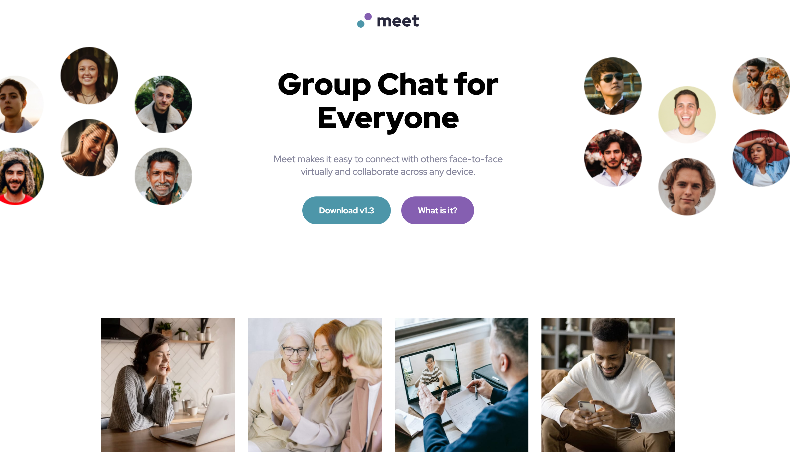

# 01-Meet-Landing-Page

Meet Landing Page

What I learned

- I used width: fit-content for the first time to center logo using margin: 0 auto;
- using vw for relative positioning
- used background images for the first time
- learned how to overlay a color and used z-index.
- if an element has a positioned value like left 36:vw outside of a media query you need to set it to left: auto or left: unset to reset it back to normal inside the media query.

